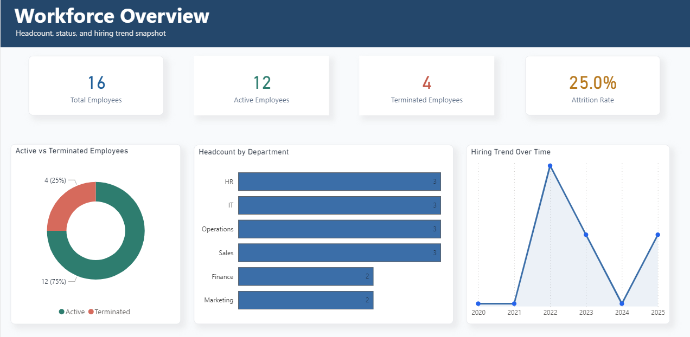
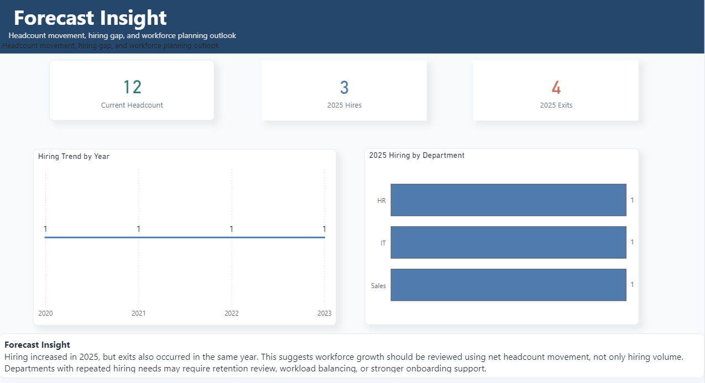

## Data Sources

This project uses two sample HRMS source files:

- `hrms_a.csv`
- `hrms_b.csv`

Both files contain employee information such as employee ID, department, hire date, termination date, salary, monthly cost, and budget cost.

## Power Query Data Cleaning

The data cleaning was done in Power Query before building the dashboard.

Main cleaning steps:

1. Loaded `hrms_a.csv` and `hrms_b.csv` into Power Query.
2. Standardized column names so both files used the same structure.
3. Cleaned employee ID format into one standard format, such as `EMP0001`.
4. Converted hire date and termination date into proper date format.
5. Standardized department names, for example:
   - `HR` to `Human Resources`
   - `IT` to `Information Technology`
   - `Ops` to `Operations`
6. Removed currency symbols from salary and cost columns.
7. Changed salary, monthly cost, and budget cost into numeric format.
8. Removed duplicate employee records.
9. Appended both HRMS files into one master table.
10. Created a new column called `employee_status`:
    - `Active` if termination date is blank
    - `Terminated` if termination date is available

Final cleaned dataset:

- `cleaned_master_data.csv`

## Features

- Attrition analysis
- Headcount tracking
- Hiring vs exit trends
- Budget vs actual workforce cost analysis
- Department-level workforce insights
- Forecast and planning view

## SQL Skills Demonstrated

- Window functions
- Time-series snapshots
- Cohort-style workforce analysis
- Salary ranking by department
- Running headcount trend
- Moving attrition average
- Budget variance analysis

## Dashboard Pages

### Page 1: Workforce Overview

This page provides a high-level snapshot of workforce size, employment status, and hiring movement.

Key visuals:

- Total headcount
- Active employees
- Terminated employees
- Attrition rate
- Active vs terminated employees
- Headcount by department
- Hiring trend over time

### Page 2: Attrition Analysis

This page focuses on employee exits and attrition risk.

Key visuals:

- Terminated employees
- Attrition rate
- Attrition by department
- Voluntary vs involuntary exits
- Exit trend over time

### Page 3: Budget vs Actual

This page compares actual workforce cost against planned budget.

Key visuals:

- Total monthly cost
- Total budget cost
- Budget variance
- Budget variance percentage
- Budget variance by department
- Actual vs budget cost by department
- Overspending vs underspending status

### Page 4: Forecast Insights

This page supports workforce planning by showing hiring movement and future planning signals.

Key visuals:

- Current headcount
- 2025 hires
- 2025 exits
- Hiring trend by year
- 2025 hiring by department
- Forecast insight summary

## Key Insights

| Insight | Business Impact | Recommendation | Suggested Action |
| --- | --- | --- | --- |
| Headcount increased in 2025, but several new hires were junior-level employees. | Short-term productivity may drop while new employees are still onboarding. | Balance workforce growth with capability planning. | Track new-hire ramp-up time and assign mentors. |
| Sales shows elevated attrition because both voluntary and involuntary exits occurred in the department. | High attrition can increase hiring cost and disrupt sales continuity. | Prioritize Sales for deeper attrition review. | Review exit reasons, workload, manager feedback, and compensation competitiveness. |
| Information Technology has the highest salary concentration, driven by senior technical roles. | IT workforce cost can strongly affect total budget. | Monitor critical-role cost separately from general headcount. | Track salary rank, role criticality, and replacement risk. |
| Budget overspend is concentrated in teams where actual workforce cost is above planned budget. | Overspending can reduce budget flexibility. | Separate planned hiring growth from unplanned cost increases. | Review departments with positive variance and validate budget assumptions. |
| Hiring increased in 2025, but exits also occurred in the same year. | The company may be replacing employees instead of achieving real growth. | Track net headcount movement, not only hiring volume. | Add monthly net movement and replacement hiring indicators. |

## Business Impact

This dashboard helps HR and business leaders monitor workforce movement, attrition risk, and cost performance in one reporting view.

The project supports better decisions in:

- Workforce planning
- Retention strategy
- Budget control
- Department-level hiring review
- Leadership reporting

## Recommendations

- Monitor attrition monthly by department and exit type.
- Review departments with repeated hiring and exit activity.
- Compare headcount growth with productivity and employee tenure.
- Track budget variance by department to identify cost pressure early.
- Add forecasting logic to support future workforce planning.

## Future Improvements

- Build a predictive attrition model.
- Automate the data refresh pipeline.
- Add employee engagement and performance data.
- Create department-level hiring forecasts.
- Add Power BI row-level security for HR business partners.
